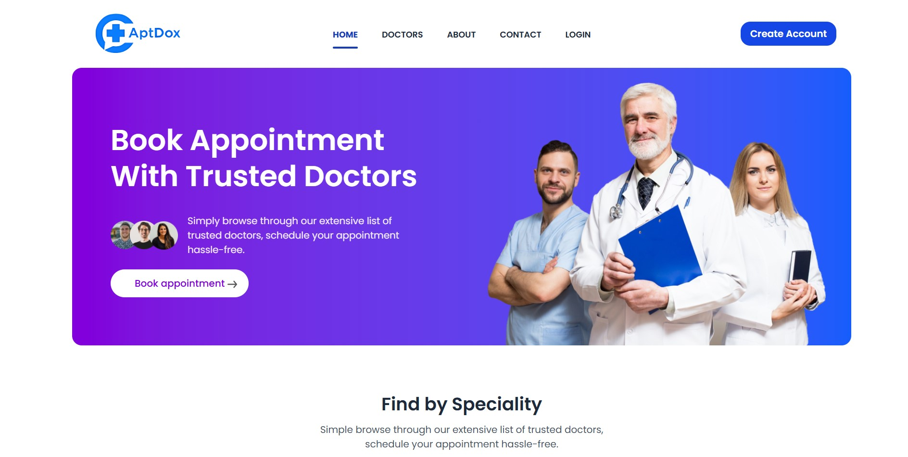
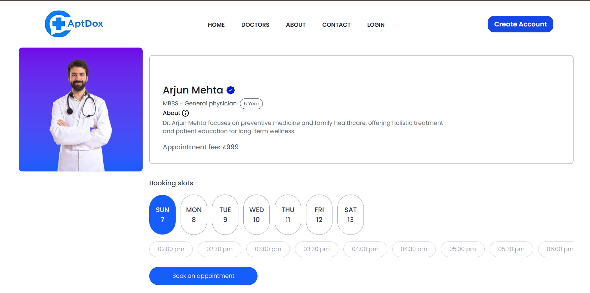
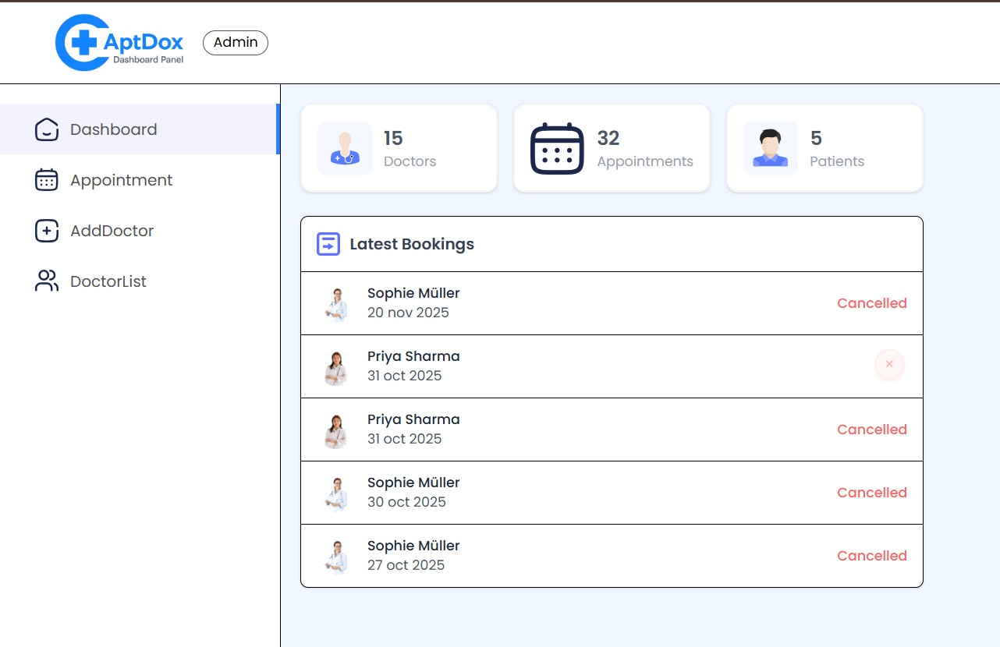
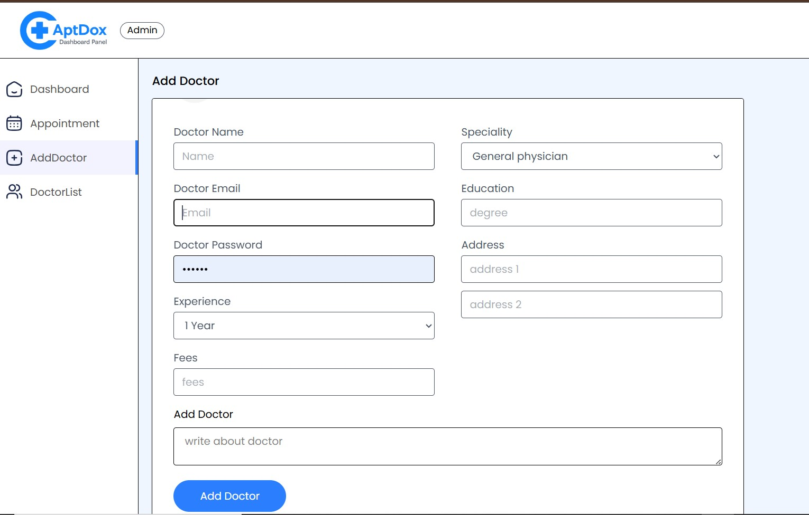
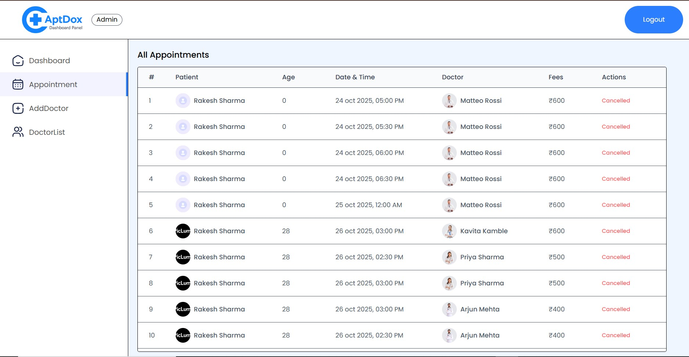
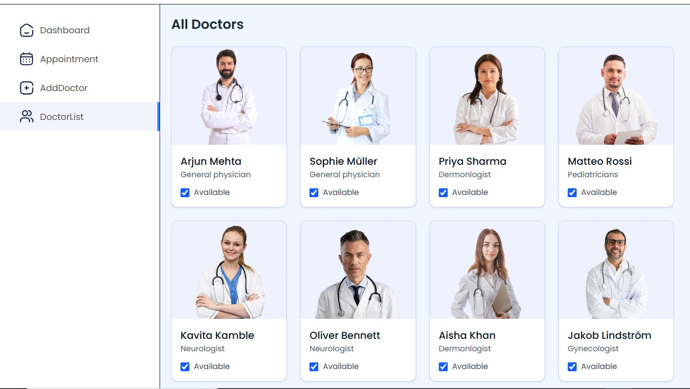
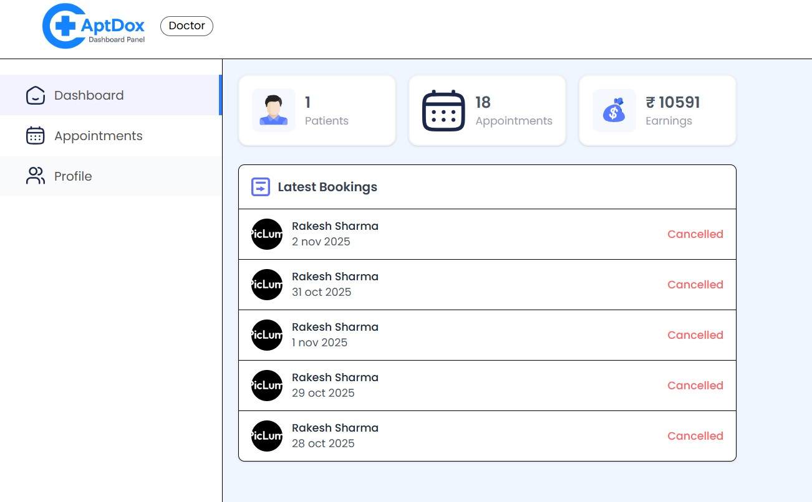
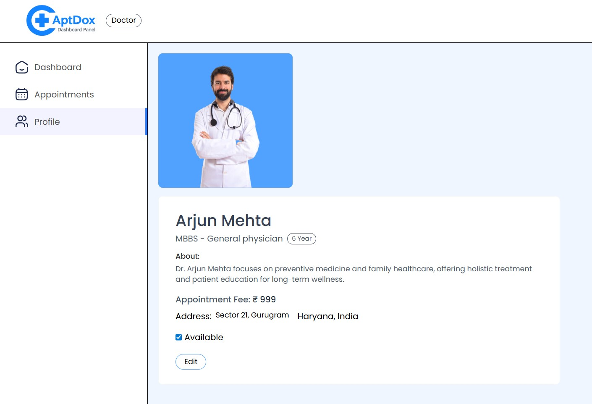

# AptDox — Full MERN Appointment Booking Application

## 📫 Live Demo
User Login: [Live Demo](https://aptdox.vercel.app/)

Admin & Doctor Panel: [Live Demo](https://aptdox-panel.vercel.app/)

--- 

AptDox is a fully functional **MERN stack** application for managing doctor appointments. Users can book appointments, doctors can manage their schedules, and admins have complete control over the system.  

This project was **inspired by [GreatStack](https://www.youtube.com/watch?v=eRTTlS0zaW8)**, but I significantly improved it: 
- added my logic,
- fixed responsiveness issues, 
- enhanced UI/UX, 
- simplified the code structure,
- added features that were missing in the original project. 

I spent **24 days** developing and refining this project to make it fully production-ready and **easy to maintain and extend**.  

---
## 🖼️ Screenshots / Panels

## Patient Booking
</img>
</img>

## Admin Panel
</img>
</img>
<br>
</img>
</img>

## Doctor Panel
</img>
</img>

---

## 🏆 Key Features & Improvements

- **User Panel:** Book appointments, view history, cancel/reschedule with a custom style and improved schema  
- **Doctor Panel:** Manage schedules, view booked appointments, update status  
- **Admin Panel:** Complete control over users, doctors, and appointments  
- **Enhanced Responsiveness:** Frontend fully responsive on mobile, tablet, and desktop  
- **Custom UI/UX Enhancements:**  
  - Completely redesigned Navbar  
  - Footer inspired by GreatStack but polished  
  - About & Contact Us sections designed from scratch  
  - MyAppointments panel redesigned with improved style and schema  
- **Doctor Filtering:** Fully functional filter to fetch all doctors  

- **Code Quality:** Simplified code structure for easy maintenance and future updates  
- **Real-time Updates:** Backend changes instantly reflect on frontend  

---

## 🛠️ Tech Stack

- **Frontend:** React, Redux, TailwindCSS, Axios  
- **Backend:** Node.js, Express.js  
- **Database:** MongoDB, Mongoose  
- **Authentication:** JWT (JSON Web Tokens)  
- **File Storage:** Cloudinary & Multer for media uploads  
- **Deployment:** Vercel (frontend), Render(backend)  

---

## 📂 Project Structure

```text
AptDox/
├── admin/
├── backend/
│   ├── config/
│   ├── controllers/
│   ├── middlewares/
│   ├── models/
│   ├── routes/
│   └── server.js
├── frontend/
│   ├── public/
│   └── src/
└── README.md
```

- **backend:** Handles APIs, authentication, and admin/doctor functionalities  
- **frontend:** React application for users, doctors, and admins  
- **admin:** Scripts and configuration for admin functionalities  

---

## 🚀 How to Run Locally

### Backend

```bash
cd backend
npm install
npm run dev
```

### Frontend 

```bash
cd frontend
npm install
npm start
```

### Admin/Doctor Frontend

```bash
cd admin
npm install
npm start
```

### Backend

```bash
cd backend
npm install
npm run dev
```

> Make sure MongoDB is running locally or use a cloud MongoDB connection string in `.env`.

---

## ✨ Notes & Philosophy

- Inspired by GreatStack, **heavily customized and improved**  
- Frontend is **more responsive and visually appealing**  
- Custom **Navbar, Footer, About & Contact Us**  
- Fixed multiple **layout, responsiveness, and usability issues**  
- Simplified code to be **easy to read, maintain, and extend**  
- Focused on **real-time updates, clean UI, and smooth UX**  

---


## Contact

* GitHub: [abhishekd358](https://github.com/abhishekd358)
