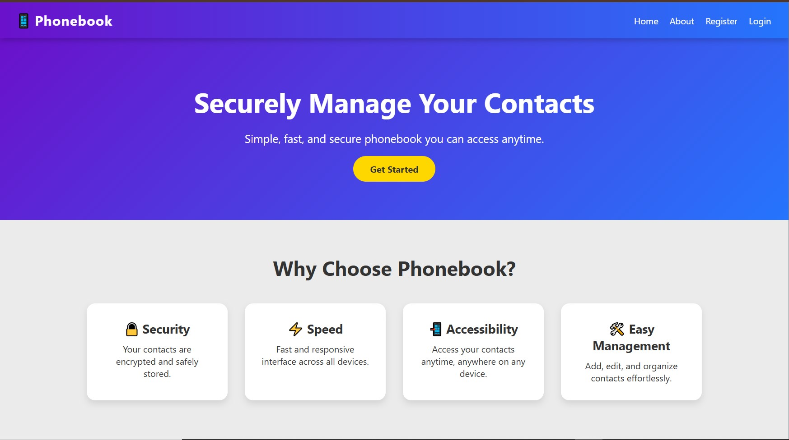
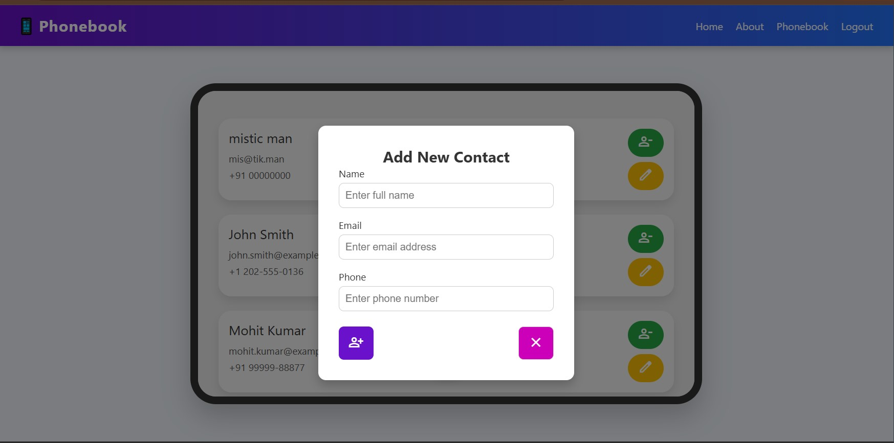

# PhoneBook — MERN Contact Management Web App

PhoneBook is a simple and efficient **MERN stack** web application designed to store and manage contacts securely. This project was **completely developed by me** when I first learned the MERN stack.  

While building it, I solved multiple issues and improved the project with the help of ChatGPT during debugging and problem-solving. The goal was to create a **clean, functional, beginner-friendly contact management system** using MongoDB as the database.

---
## 📫 Live Demo
[Live Demo](https://phonebook-psi-five.vercel.app/)

</img>
</img>


## 📱 Features

- Add new contacts (name, phone number, email)
- Edit existing contacts
- Delete contacts
- View all contacts stored in MongoDB
- Clean and simple UI
- Fully responsive interface
- Fast API performance using Express.js & Node.js
- Stores data securely in MongoDB

---

## 🛠️ Tech Stack

- **Frontend:** React, TailwindCSS / CSS  
- **Backend:** Node.js, Express.js  
- **Database:** MongoDB (with Mongoose ORM)  
- **API Communication:** Axios  
- **State Management:** React Hooks  

---

## 📂 Project Structure

```text
PhoneBook/
├── backend/
│   ├── config/
│   ├── controllers/
│   ├── models/
│   ├── routes/
│   └── server.js
├── frontend/
│   ├── public/
│   └── src/
└── README.md
```

- **backend:** REST API, models, routes, and controllers  
- **frontend:** React UI for managing contacts  


---

## 🚀 How to Run Locally

### Backend

```bash
cd backend
npm install
npm run dev
```

### Frontend

```bash
cd frontend
npm install
npm start
```

> Ensure MongoDB is running locally or replace the connection string in `.env` with your cloud MongoDB URI.

---

## ✨ Notes

- This is my **first complete MERN project**, built from scratch  
- Learned API building,CRUD, routing, MongoDB schema, and React fundamentals  
- Debugged and solved issues with the help of ChatGPT  
- Created to understand CRUD operations end-to-end  
- Simple, clean, and perfect for beginners learning MERN  

---

## 🔐 Contact

For any questions or to see the project in detail:

- GitHub: [abhishekd358](https://github.com/abhishekd358)
