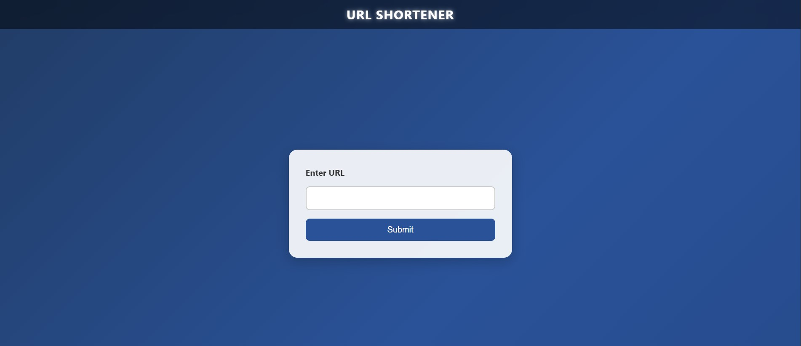

# 🔗 URL Shortener with Node.js, Express, and MongoDB

This is a simple and functional URL shortener web application built using **Node.js**, **Express**, and **MongoDB**. It allows users to input a long URL and receive a shortened version that can be used for redirection.

---

## 🚀 Features

- Shortens long URLs to a concise and unique short code
- Redirects to the original URL when the short code is accessed
- Stores data in **MongoDB Atlas**
- Displays shortened URL on the UI
- Uses **EJS** for dynamic frontend rendering

---

## 📦 Tech Stack

- Backend: [Node.js](https://nodejs.org/), [Express.js](https://expressjs.com/)
- Database: [MongoDB Atlas](https://www.mongodb.com/cloud/atlas)
- Templating Engine: [EJS](https://ejs.co/)
- Styling: Custom CSS

---


## 📁 Project Structure
```
url-shortener/
├── controllers/
│ └── urldata.controller.js # Handles URL creation and redirection
├── models/
│ └── urldata.js # Mongoose schema for URLs
├── public/
│ └── css/
│ └── style.css # Optional styling
├── views/
│ └── index.ejs # Main frontend page
├── .env # Environment variables (not included)
├── server.js # Main Express app
└── README.md

```


### 📸 Screenshot
<!-- Add your own image file -->


### 🔁 Example Workflow
- User enters a long URL in the form.
- Server generates a unique shortCode.
- Short URL is displayed (e.g., http://localhost:1200/abc123).
- Visiting that short URL redirects to the original long URL.


### 📜 License
This project is licensed under the MIT License.

### ✍️ Author
GitHub: @abhishekd358