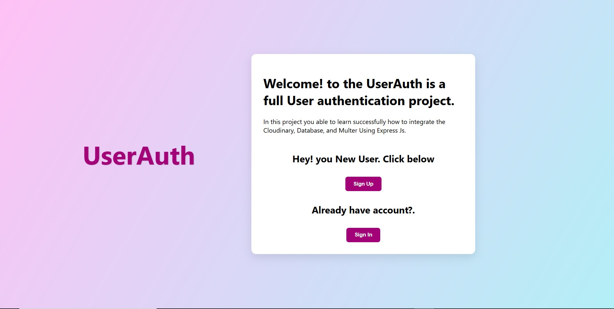
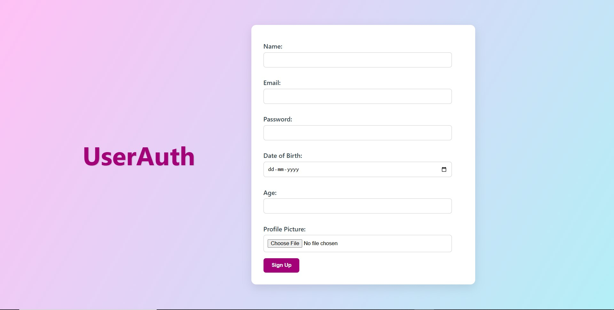

# 🛡️ User Authentication & Profile Image Upload Web-App

This is a full-stack web application built with **Node.js**, **Express**, **MongoDB**, **Multer**, and **Cloudinary**. It allows users to:

- 📝 Sign up with profile details (name, email, password, age, DOB)
- 📤 Upload profile pictures
- 🔒 Log in securely
- 👤 View their profile data with profile image
- 🧾 Data persistence using MongoDB
- ☁️ Cloud image hosting with Cloudinary

---

## 📦 Features

- User Registration (with image, age, DOB)
- Login authentication
- Upload and display profile picture (stored on Cloudinary)
- Responsive UI with animated CSS
- MongoDB integration for storing user data
- Multer for file uploads
- Cloudinary for image storage

---

## 🔧 Tech Stack

- Node.js
- Express.js
- MongoDB (Mongoose)
- EJS (Templating Engine)
- Multer (File Upload)
- Cloudinary (Cloud Storage)
- CSS Animations & Transitions

---

## ⚙️ Installation

```bash
git clone https://github.com/yourusername/user-auth-image-upload-app.git
cd user-auth-image-upload-app
npm install
```

### 🔐 Setup and Installation
#### installation Requirement
- nodejs
- express
- ejs
- multer
- mongoose
- cloudinary
#### setup
- add your cludinary configuration like API key, Secrect Key, etc...
- add your mongoose configuration string


### 📸 Screenshot
<!-- Add your own image file -->




### 📜 License
This project is licensed under the MIT License.

### ✍️ Author
GitHub: @abhishekd358