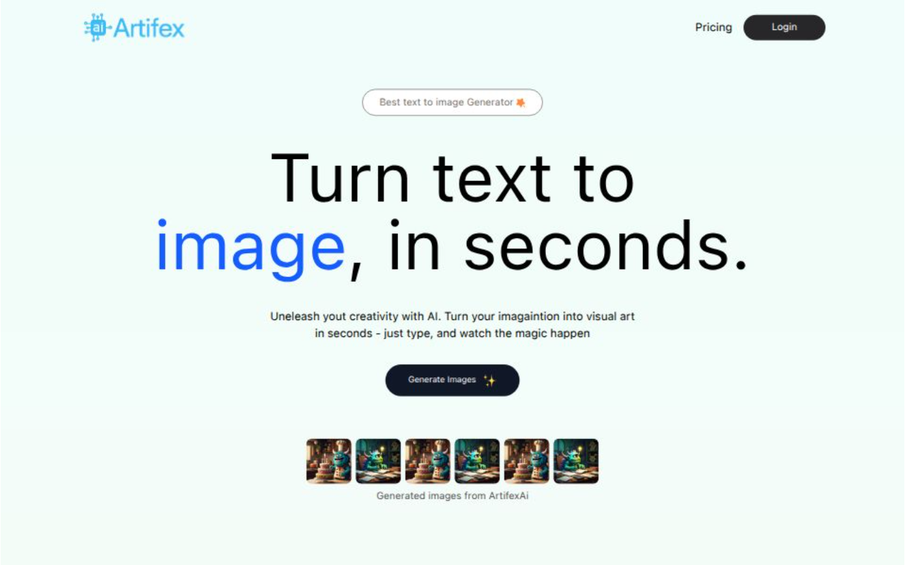

# Artifex — AI Image Generation Web App

Artifex is a modern **AI-powered image generation web application** that allows users to create unique images using natural language prompts. The project integrates **Pollination AI** as the core image generation engine, delivering fast and creative outputs.

---

# 📫 Live Demo
[Live Demo](https://artifex-frontend.vercel.app/)

</img>
</img>

---

## 🎨 Features

- **AI Image Generation:** Create images using Pollination AI with text prompts  
- **Progress Indicator:** Real-time visual progress bar showing generation status  
- **Prompt-Based Control:** Users can generate different types/styles of art  
- **Image Preview:** Displays the generated image instantly once complete  
- **Clean & Minimal UI:** Simple, modern interface focused on user experience  
- **Responsive Design:** Fully responsive on desktop and mobile  
- **History (Optional):** Can be extended to store previously generated images  

---

## 🛠️ Tech Stack

- **Frontend:** React, TailwindCSS  
- **Backend:** Node.js / Express (if used)  
- **AI Engine:** Pollination AI (Image Generation API)  
- **State Management:** React Hooks  
- **Optional Storage:** Local storage or backend database  


---

## 🚀 How to Run Locally

### Backend (if included)

```bash
cd backend
npm install
npm run dev
```

### Frontend

```bash
cd frontend
npm install
npm start
```

> Make sure to add your **Pollination AI API Key** in your `.env` file.

---

## ✨ Notes

- Used **Pollination AI** for high-quality image generation  
- Implemented a **smooth generation progress tracker**  
- Focused on a clean UI and intuitive user experience  
- Built to understand AI image APIs and async UX flow  
- Easy to extend with:  
  - User accounts  
  - Image gallery/history  
  - Style presets  
  - Download & share options  

---

## 📫 Contact

- GitHub: [abhishekd358](https://github.com/abhishekd358)

